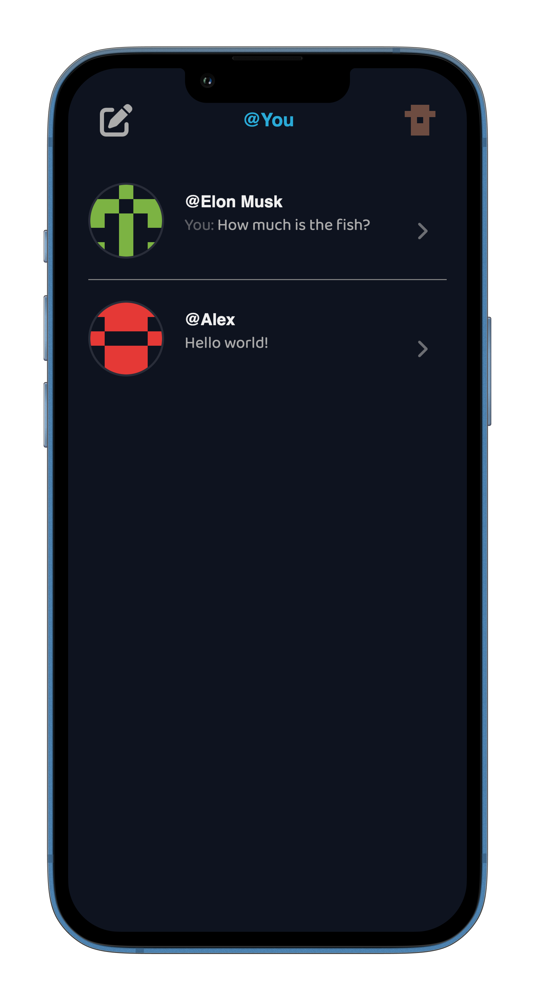

# Example: Simple Messenger

This repository demonstrates some essential concept of the [UIX](https://uix.unyt.org) framework such as [pointers](https://unyt.org/glossary#pointer) and [Web components](https://unyt.org/glossary#web-components) using the example of a **simple messenger**.


The repository includes persistent data storage and implements [front-end](https://unyt.org/glossary#back-end) rendering.

## Installation
1. Install the **UIX command line tool** following the [Getting Started](https://docs.unyt.org/manual/uix/getting-started#the-uix-command-line-tool) guide in our documentation.

2. Clone this repository to your local machine:

	```bash
	$ git clone https://github.com/unyt-org/example-simple-messenger.git
	```
3. Run the project local
	```bash
	$ uix -wlb --port 8000
	```
4. Navigate to your favourite web browser and open http://localhost:8000 to see everything in action. 

## Structure
This diagram outlines the UIX default project structure.
We split our code base in [back-end](https://unyt.org/glossary#back-end), [front-end](https://unyt.org/glossary#front-end), and commons folder.
```
.
└── example-simple-messenger/
    ├── backend/
    │   ├── .dx                 // Config file for deployment
    │   └── entrypoint.tsx      // Back-end entrypoint
    ├── common/
    │   └── compoments/
    │       ├── ChatPage.scss   // Chat style declaration
    │       ├── ChatPage.tsx    // Chat component
    │       ├── Overview.scss   // Overview style declaration
    │       └── Overview.tsx    // Overview component
    ├── frontend/
    │   ├── entrypoint.css      // Front-end style declaration
    │   └── entrypoint.tsx      // Front-end entrypoint
    ├── app.dx                  // Endpoint config file
    └── deno.json               // Deno config file
```

## Features
* Multiple chat rooms
* Synchronized messages

## Preview



## Explanation
### Concept of Pointers
In [UIX](https://uix.unyt.org), [Pointers](https://unyt.org/glossary#pointer) are a fundamental concept for managing shared data across different parts of your application. Pointers allow different components or [endpoints](https://unyt.org/glossary#endpoint) to access and modify the same data. In the context of our chat application, a Pointer could represent a single message.

Pointers are synchronized over the [Supranet](https://unyt.org/glossary#supranet), based on our powerful [DATEX](https://datex.unyt.org) networking protocol that ensures real-time updates and consistency across endpoints. When one user sends a message, the changes are propagated to the recipient through the Supranet, keeping the data in sync.

### Persistent Storage of Pointer Data
To provide a seamless experience, our messenger app also demonstrates how to persistently store Pointer data. This means that even if the application is restarted, the chat histories are up-to-date.


---

<sub>&copy; unyt 2023 • [unyt.org](https://unyt.org)</sub>
